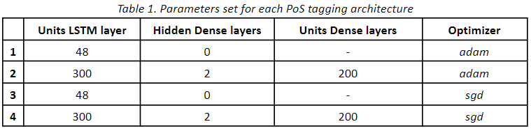
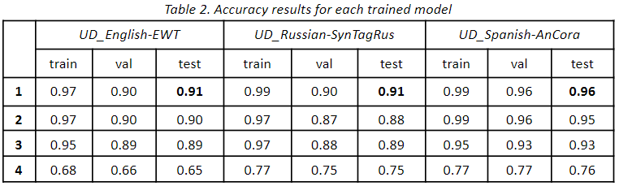

PoS Tagging
===

Part-of-Speech (PoS) tagging is a fundamental task in Natural Language Processing (NLP) that involves assigning a part-of-speech label to each word in a sentence. This project focuses on developing a PoS tagger using the CoNLL-U datasets, which are widely used for training and evaluating PoS tagging models.

## Dataset Description
The CoNLL-U datasets consist of annotated sentences where each word is labeled with its corresponding part-of-speech tag. The data is formatted according to the CoNLL-U format, which includes columns for word forms, lemmas, PoS tags, morphological features, and syntactic dependencies.

## Results comparison





## Install the environment in a local device
The following steps must be followed to install the dependencies required for running the application:

1. Navigate to the project directory
```
cd (`project_path`)
```

2. Create a conda environment from a .yml file
```
conda create -n <yourenvname> python=3.10
```

3. Install dependencies
```
pip install -r requirements.txt
```

## Execute the notebook in Google Colab
1. Upload the provided files to Google Drive (src folder) and open Google Colab.
2. Load the notebook (notebook.ipynb) and
execute cells using the button Run.

## Project Structure
The project is organized as follows:

```
├── Datasources
├── src
│   ├── fileparser.py
│   ├── posmodel.py
│   ├── preprocess.py
```

## Dependencies
The main libraries used in this project include:

- Tensorflow
- conllu
- tqdm
- InquirerPy
- matplotlib

## Methodology
### Data Preprocessing
The data preprocessing step involves:

- Loading the CoNLL-U datasets: Reading the raw CoNLL-U files from the data/raw directory.
- Parsing the data: Extracting relevant columns such as word forms and PoS tags.
- Tokenization and Padding: Preparing the data for model input by tokenizing sentences and padding them to a uniform length.
- Encoding labels: Converting PoS tags to numerical labels for model training.

### Model Architecture
The PoS model is designed with the following architecture:

- An Input layer
- A TextVectorization layer
- An Embedding layer
- A Bidirectional LSTM layer
- Zero or more hidden TimeDistributed Dense layers
- An Output TimeDistributed Dense layer
